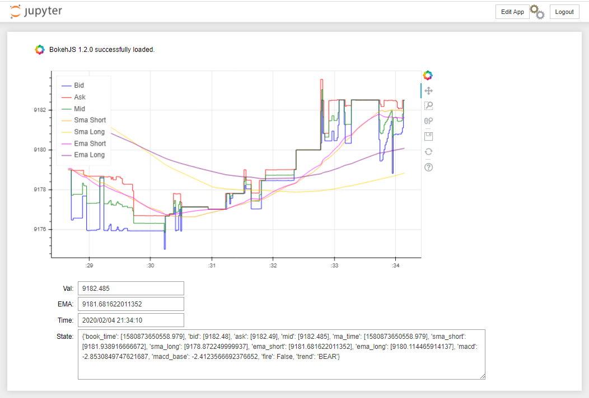

# Crypto Valuation Dashboard

A Quick Bokeh Dashboard to chart live prices for different coins. Interactive chart with SMA/EMA overlays.

**Exchanges:**
* Coinbase Pro: https://pro.coinbase.com/

### Example 
BTCUSD:

### Environment
1. Download miniconda: https://docs.conda.io/en/latest/miniconda.html
1. Goto cloned repo directory
    * `cd <HOME>/CryptoValuation`
1. Create conda environment
    * `conda env create -f environment.yml`

### Quickstart
1. Goto cloned repo directory
    * `cd <HOME>/CryptoValuation`
1. Setup and activate environment (see above)
    * `conda activate crypto_val_dash`
1. Set up Dashboard (run in new terminal or background)
    * `jupyter notebook --config=dashboard/jupyter_notebook_config.py --notebook-dir=dashboard`
1. Set up Valuation Analysis Reactor (run in new terminal or background)
    * `python val_analysis/cli.py --config_path val_analysis/config/config.yaml`
1. Set up Market Data Publisher (Coinbase)
    * `python md_publisher/cli.py --config_path md_publisher/config/config.yaml --instance coinbase_pro`
